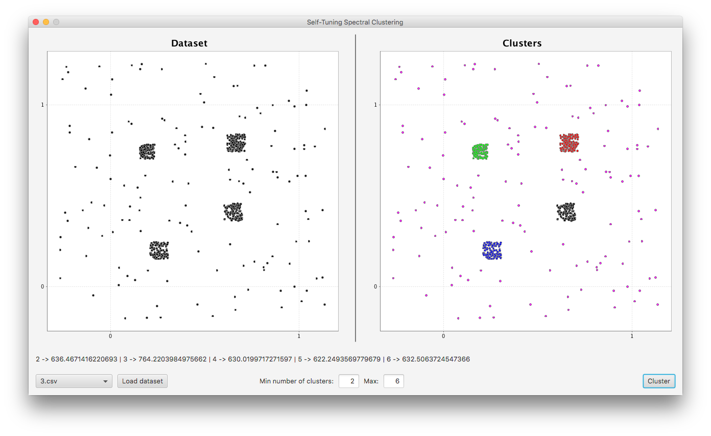

# ststc-uicluster

<p align="center">

</p>

Based on the paper [*Self Tuning Spectral Clustering algorithm*](http://www.vision.caltech.edu/lihi/Demos/SelfTuningClustering.html).

## How to install the dependencies

The core of the application is not publicly available yet. Run `ststc-uicluster.jar` to use the application (requires Java 1.8.0_92).

## How to build the fat jar?

```
sbt assembly
```

Thanks to `project/assembly.sbt`.
